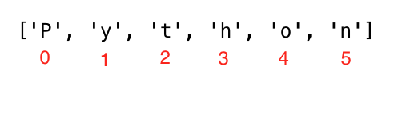

# Day 4
WHAT I LEARNT:

# strings
Text is a string data type. Any data type written as text is a string. Any data under single, double or triple quote are strings. There are different string methods and built-in functions to deal with string data types. To check the length of a string use the len() method

# HOW TO CREATE A STRING:
```python
letter = 'P'                # A string could be a single character or a bunch of texts
print(letter)               # P
print(len(letter))          # 1
greeting = 'Hello, World!'  # String could be made using a single or double quote,"Hello, World!"
print(greeting)             # Hello, World!
print(len(greeting))        # 13
sentence = "I hope you are enjoying 30 days of Python Challenge"
print(sentence)
```
Multiline string is created by using triple single (''') or triple double quotes ("""). See the example below.
```python
multiline_string = '''I am a teacher and enjoy teaching.
I didn't find anything as rewarding as empowering people.
That is why I created 30 days of python.'''
print(multiline_string)

# Another way of doing the same thing
multiline_string = """I am a teacher and enjoy teaching.
I didn't find anything as rewarding as empowering people.
That is why I created 30 days of python."""
print(multiline_string)
```
# String Concatenation
We can connect strings together. Merging or connecting strings is called concatenation. See the example below:
```python
first_name = 'Asabeneh'
last_name = 'Yetayeh'
space = ' '
full_name = first_name  +  space + last_name
print(full_name) # Asabeneh Yetayeh
# Checking the length of a string using len() built-in function
print(len(first_name))  # 8
print(len(last_name))   # 7
print(len(first_name) > len(last_name)) # True
print(len(full_name)) # 16
```
# Escape Sequences in Strings
In Python and other programming languages \ followed by a character is an escape sequence. Let us see the most common escape characters:

\n: new line

\t: Tab means(8 spaces)

\\: Back slash

\': Single quote (')

\": Double quote (")

Examples:
```python
print('I hope everyone is enjoying the Python Challenge.\nAre you ?') # line break
print('Days\tTopics\tExercises') # adding tab space or 4 spaces
print('Day 1\t5\t5')
print('Day 2\t6\t20')
print('Day 3\t5\t23')
print('Day 4\t1\t35')
print('This is a backslash  symbol (\\)') # To write a backslash
print('In every programming language it starts with \"Hello, World!\"') # to write a double quote inside a single quote

# output
I hope every one is enjoying the Python Challenge.
Are you ?
Days  Topics  Exercises
Day 1	5	    5
Day 2	6	    20
Day 3	5	    23
Day 4	1	    35
This is a backslash  symbol (\)
In every programming language it starts with "Hello, World!"
```
# String Formatting
Old Style String Formatting (% Operator)
In Python there are many ways of formatting strings. In this section, we will cover some of them. The "%" operator is used to format a set of variables enclosed in a "tuple" (a fixed size list), together with a format string, which contains normal text together with "argument specifiers", special symbols like "%s", "%d", "%f", "%.number of digitsf".

%s - String (or any object with a string representation, like numbers)

%d - Integers

%f - Floating point numbers

"%.number of digitsf" - Floating point numbers with fixed precision
```python
# Strings only
first_name = 'Asabeneh'
last_name = 'Yetayeh'
language = 'Python'
formated_string = 'I am %s %s. I teach %s' %(first_name, last_name, language)
print(formated_string)

# Strings  and numbers
radius = 10
pi = 3.14
area = pi * radius ** 2
formated_string = 'The area of circle with a radius %d is %.2f.' %(radius, area) # 2 refers the 2 significant digits after the point

python_libraries = ['Django', 'Flask', 'NumPy', 'Matplotlib','Pandas']
formated_string = 'The following are python libraries:%s' % (python_libraries)
print(formated_string) # "The following are python libraries:['Django', 'Flask', 'NumPy', 'Matplotlib','Pandas']"
```

# Python Strings as Sequences of Characters.
Python strings are sequences of characters, and share their basic methods of access with other Python ordered sequences of objects – lists and tuples. The simplest way of extracting single characters from strings (and individual members from any sequence) is to unpack them into corresponding variables.

UNPACKING CHARACTERS:
```python
language = 'Python'
a,b,c,d,e,f = language # unpacking sequence characters into variables
print(a) # P
print(b) # y
print(c) # t
print(d) # h
print(e) # o
print(f) # n
```
ACCESSING CHARACTERS IN STRINGS BY INDEX.


```python
language = 'Python'
first_letter = language[0]
print(first_letter) # P
second_letter = language[1]
print(second_letter) # y
last_index = len(language) - 1
last_letter = language[last_index]
print(last_letter) # n
```
If we want to start from right end we can use negative indexing. -1 is the last index.
```python
language = 'Python'
last_letter = language[-1]
print(last_letter) # n
second_last = language[-2]
print(second_last) # o
```

# SLICING PYTHON STRINGS
In python we can slice strings into substrings.

```python
language = 'Python'
first_three = language[0:3] # starts at zero index and up to 3 but not include 3
print(first_three) #Pyt
last_three = language[3:6]
print(last_three) # hon
# Another way
last_three = language[-3:]
print(last_three)   # hon
last_three = language[3:]
print(last_three)   # hon
```

# Reversing a String
Strings can easily be reversed in python.
```python
greeting = 'Hello, World!'
print(greeting[::-1]) # !dlroW ,olleH
```

# Skipping Characters while slicing
It is possible to skip characters while slicing by passing step argument to slice method.
```python
language = 'Python'
pto = language[0:6:2] #
print(pto) # Pto
```

# STRING METHODS.
There are many string methods which allows us to format strings..
Example:
. capitalize():  Converts the first character of the string to capital letter
```python
challenge = 'thirty days of python'
print(challenge.capitalize()) # 'Thirty days of python'
```

. count(): returns occurrences of substring in string, count(substring, start=.., end=..). The start is a starting indexing for counting and end is the last index to count.
```python
challenge = 'thirty days of python'
print(challenge.count('y')) # 3
print(challenge.count('y', 7, 14)) # 1, 
print(challenge.count('th')) # 2`
```

. endswith(): Checks if a string ends with a specified ending
```python
challenge = 'thirty days of python'
print(challenge.endswith('on'))   # True
print(challenge.endswith('tion')) # False
```

. expandtabs(): Replaces tab character with spaces, default tab size is 8. It takes tab size argument
```python
challenge = 'thirty\tdays\tof\tpython'
print(challenge.expandtabs())   # 'thirty  days    of      python'
print(challenge.expandtabs(10)) # 'thirty    days      of        python'
```

. find(): Returns the index of the first occurrence of a substring, if not found returns -1
```python
challenge = 'thirty days of python'
print(challenge.find('y'))  # 5
print(challenge.find('th')) # 0
```

. rfind(): Returns the index of the last occurrence of a substring, if not found returns -1
```python
challenge = 'thirty days of python'
print(challenge.rfind('y'))  # 16
print(challenge.rfind('th')) # 17
```

. format(): formats string into a nicer output
```python
first_name = 'Asabeneh'
last_name = 'Yetayeh'
age = 250
job = 'teacher'
country = 'Finland'
sentence = 'I am {} {}. I am a {}. I am {} years old. I live in {}.'.format(first_name, last_name, job, age, country)
print(sentence) # I am Asabeneh Yetayeh. I am 250 years old. I am a teacher. I live in Finland.

radius = 10
pi = 3.14
area = pi * radius ** 2
result = 'The area of a circle with radius {} is {}'.format(str(radius), str(area))
print(result) # The area of a circle with radius 10 is 314
```

. index(): Returns the lowest index of a substring, additional arguments indicate starting and ending index (default 0 and string length - 1). If the substring is not found it raises a valueError.
```python
challenge = 'thirty days of python'
sub_string = 'da'
print(challenge.index(sub_string))  # 7
print(challenge.index(sub_string, 9)) # error
```
. rindex(): Returns the highest index of a substring, additional arguments indicate starting and ending index (default 0 and string length - 1)
```python
challenge = 'thirty days of python'
sub_string = 'da'
print(challenge.rindex(sub_string))  # 7
print(challenge.rindex(sub_string, 9)) # error
print(challenge.rindex('on', 8)) # 19
```

. isalnum(): Checks alphanumeric character
```python
challenge = 'ThirtyDaysPython'
print(challenge.isalnum()) # True

challenge = '30DaysPython'
print(challenge.isalnum()) # True

challenge = 'thirty days of python'
print(challenge.isalnum()) # False, space is not an alphanumeric character

challenge = 'thirty days of python 2019'
print(challenge.isalnum()) # False
```

. isalpha(): Checks if all string elements are alphabet characters (a-z and A-Z)
```python
challenge = 'thirty days of python'
print(challenge.isalpha()) # False, space is once again excluded
challenge = 'ThirtyDaysPython'
print(challenge.isalpha()) # True
num = '123'
print(num.isalpha())      # False
```

. isdecimal(): Checks if all characters in a string are decimal (0-9)
```python
challenge = 'thirty days of python'
print(challenge.isdecimal())  # False
challenge = '123'
print(challenge.isdecimal())  # True
challenge = '\u00B2'
print(challenge.isdigit())   # True 
challenge = '12 3'
print(challenge.isdecimal())  # False, space not allowed
```

. isdigit(): Checks if all characters in a string are numbers (0-9 and some other unicode characters for numbers)
```python
challenge = 'Thirty'
print(challenge.isdigit()) # False
challenge = '30'
print(challenge.isdigit())   # True
challenge = '\u00B2'
print(challenge.isdigit())   # True
```

. isnumeric(): Checks if all characters in a string are numbers or number related (just like isdigit(), just accepts more symbols, like ½)
```python
num = '10'
print(num.isnumeric()) # True
num = '\u00BD' # ½
print(num.isnumeric()) # True
num = '10.5'
print(num.isnumeric()) # False
```
. isidentifier(): Checks for a valid identifier - it checks if a string is a valid variable name
```python 
challenge = '30DaysOfPython'
print(challenge.isidentifier()) # False, because it starts with a number
challenge = 'thirty_days_of_python'
print(challenge.isidentifier()) # True
```
. islower(): Checks if all alphabet characters in the string are lowercase
```python 
challenge = 'thirty days of python'
print(challenge.islower()) # True
challenge = 'Thirty days of python'
print(challenge.islower()) # False
```
. isupper(): Checks if all alphabet characters in the string are uppercase
```python
challenge = 'thirty days of python'
print(challenge.isupper()) #  False
challenge = 'THIRTY DAYS OF PYTHON'
print(challenge.isupper()) # True
```

. join(): Returns a concatenated string
```python
web_tech = ['HTML', 'CSS', 'JavaScript', 'React']
result = ' '.join(web_tech)
print(result) # 'HTML CSS JavaScript React'
```

```python
web_tech = ['HTML', 'CSS', 'JavaScript', 'React']
result = '# '.join(web_tech)
print(result) # 'HTML# CSS# JavaScript# React'
```

. strip(): Removes all given characters starting from the beginning and end of the string
```python
challenge = 'thirty days of pythoonnn'
print(challenge.strip('noth')) # 'irty days of py'
```

. replace(): Replaces substring with a given string.
```python
challenge = 'thirty days of python'
print(challenge.replace('python', 'coding')) # 'thirty days of coding'
```

. split(): Splits the string, using given string or space as a separator
```python
challenge = 'thirty days of python'
print(challenge.split()) # ['thirty', 'days', 'of', 'python']
challenge = 'thirty, days, of, python'
print(challenge.split(', ')) # ['thirty', 'days', 'of', 'python']
```
. title(): Returns a title cased string
```python
challenge = 'thirty days of python'
print(challenge.title()) # Thirty Days Of Python
```

. swapcase(): Converts all uppercase characters to lowercase and all lowercase characters to uppercase characters
```python
challenge = 'thirty days of python'
print(challenge.swapcase())   # THIRTY DAYS OF PYTHON
challenge = 'Thirty Days Of Python'
print(challenge.swapcase())  # tHIRTY dAYS oF pYTHON
```

. startswith(): Checks if String Starts with the Specified String
```python
challenge = 'thirty days of python'
print(challenge.startswith('thirty')) # True

challenge = '30 days of python'
print(challenge.startswith('thirty')) # False
```

# EXERCISES.
1. Concatenate the string 'Thirty', 'Days', 'Of', 'Python' to a single string, 'Thirty Days Of Python'.

2. Concatenate the string 'Coding', 'For' , 'All' to a single string, 'Coding For All'.

3. Declare a variable named company and assign it to an initial value "Coding For All".

4. Print the variable company using print().

5. Print the length of the company string using len() method and print().

6. Change all the characters to uppercase letters using upper() method.

7. Change all the characters to lowercase letters using lower() method.

8. Use capitalize(), title(), swapcase() methods to format the value of the string Coding For All.

9. Cut(slice) out the first word of Coding For All string.

10. Check if Coding For All string contains a word Coding using the method index, find or other methods.

11. Replace the word coding in the string 'Coding For All' to Python.

12. Change "Python for Everyone" to "Python for All" using the replace method or other methods.

13. Split the string 'Coding For All' using space as the separator (split()) .

14. "Facebook, Google, Microsoft, Apple, IBM, Oracle, Amazon" split the string at the comma.

15. What is the character at index 0 in the string Coding For All.

16. What is the last index of the string Coding For All.

17. What character is at index 10 in "Coding For All" string.

18. Create an acronym or an abbreviation for the name 'Python For Everyone'.

19. Create an acronym or an abbreviation for the name 'Coding For All'.

20. Use index to determine the position of the first occurrence of C in Coding For All.

21. Use index to determine the position of the first occurrence of F in Coding For All.

22. Use rfind to determine the position of the last occurrence of l in Coding For All People.

23. Use index or find to find the position of the first occurrence of the word 'because' in the following sentence: 'You cannot end a sentence with because because because is a conjunction'

24. Use rindex to find the position of the last occurrence of the word because in the following sentence: 'You cannot end a sentence with because because because is a conjunction'

25. Slice out the phrase 'because because because' in the following sentence: 'You cannot end a sentence with because because because is a conjunction'

26. Find the position of the first occurrence of the word 'because' in the following sentence: 'You cannot end a sentence with because because because is a conjunction'

27. Slice out the phrase 'because because because' in the following sentence: 'You cannot end a sentence with because because because is a conjunction'

28. Does 'Coding For All' start with a substring Coding?

29. Does 'Coding For All' end with a substring coding?

30. '   Coding For All      '  , remove the left and right trailing spaces in the given string.

31. Which one of the following variables return True when we use the method isidentifier():
  . 30DaysOfPython
.thirty_days_of_python

32. The following list contains the names of some of python libraries: ['Django', 'Flask', 'Bottle', 'Pyramid', 'Falcon']. Join the list with a hash with space string.


33. Use the new line escape sequence to separate the following sentences
```python
I am enjoying this challenge.
I just wonder what is next.
```

34. Use a tab escape sequence to write the following lines
```python
Name   Age     Country     City
Sam     23    Finland  Helsinki
```

35. Use the string formatting method to display the following:
```python
radius = 10
area = 3.14 * radius ** 2
The area of a circle with radius 10 is 314 meters square.
```

36. Make the following using string formatting methods:
```python
8 + 6 = 14
8 - 6 = 2
8 * 6 = 48
8 / 6 = 1.33
8 % 6 = 2
8 // 6 = 1
8 ** 6 = 262144
```
